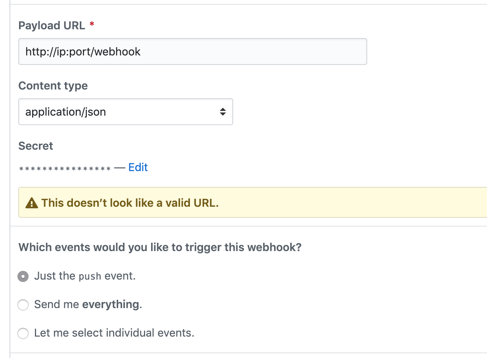

#  使用webhooks 在服务器自动部署hexo
### 1. 配置nginx 根路径, 指向hexo生产的静态资源文件夹public

```js
location / {
      index index.html;
      root  /public;
   }
```

### 2. 入口文件app.js 

```js
// 入口文件 app.js
const http = require('http');
const handler = require('./webhooks');

http.createServer((req, res) => {
    handler(req, res, err => {
        res.statusCode = 404;
        res.end('no such location')
    })
}).listen(3038);

```

### 3. webhooks 
首先你需要在github上对应的项目setting里面填写webhooks信息,如下图:


ip和端口填服务器的ip和监听webhooks的端口

下面上代码：

```js
const handler = createHandler({path: '/webhook', secret: '******'});

// 这里是监听到git push 后的回调函数
function runGitShell(cmd, args, callback) {
    const gitChild = spawn(cmd, args);
    var response = '';
    gitChild.stdout.on('data', buffer => response += buffer.toString())
    gitChild.stderr.on('end', () => callback(response));
 }

handler.on('error', err => console.log(`Error: ${err}`))

handler.on('push', e => {
    console.log(`receoved a push event, ${e.payload.repository.name}`);
    runGitShell('sh', ['./deploy.sh'], (txt) => console.log(txt));
})
```

### 4. 检测到更新后执行的deploy.sh脚本
```sh
   #! /bin/bash
   git pull
   hexo clean && hexo g
```